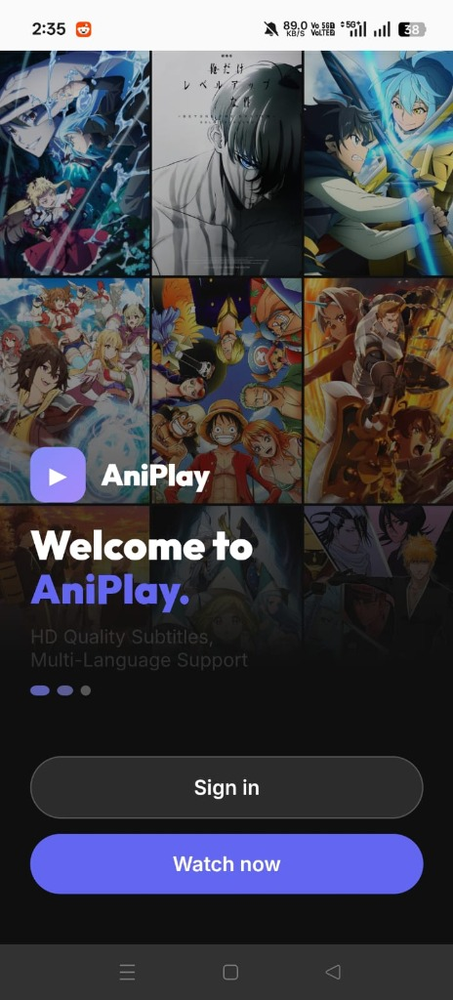
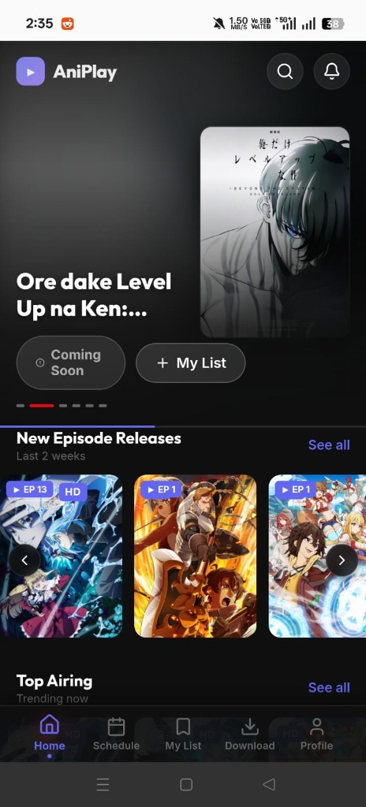
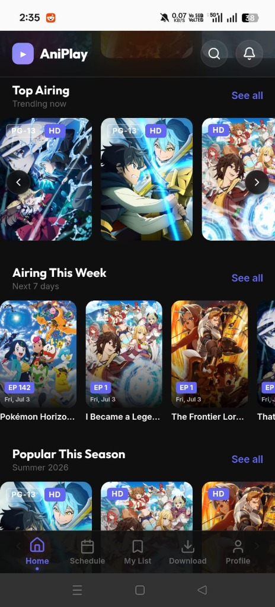
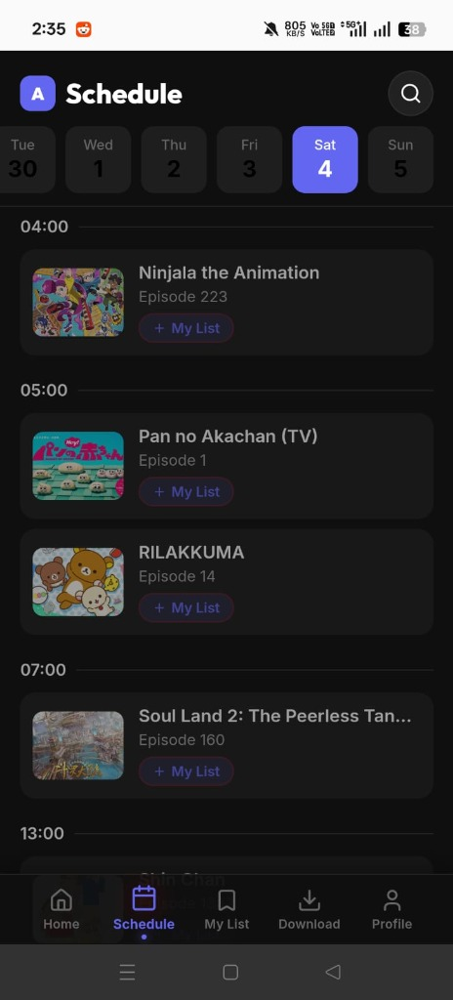
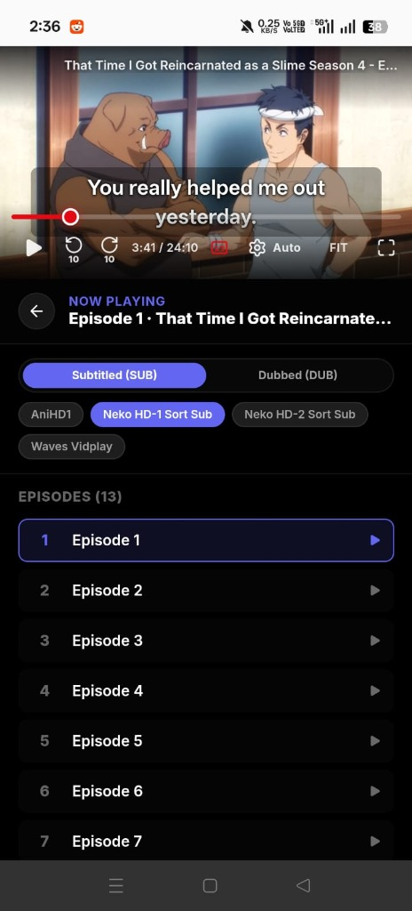

# 🎬 AniPlay — Premium Mobile Anime Client

AniPlay is a premium, open-source mobile anime streaming client designed for Android devices. Built using a hybrid web-native architecture (React + Vite + Capacitor), it offers a fluid, glassmorphic UI, responsive controls, and high-performance video playback.

---

## 📱 Screenshots & Application Walkthrough

AniPlay provides a sleek, modern, and intuitive user interface designed to match premium streaming platforms. Below is an overview of the key screens and features:

| **Welcome & Onboarding** | **Spotlight & Home** | **Discovery Feed** |
| :---: | :---: | :---: |
|  |  |  |
| **Welcome Screen** A stunning glassmorphic intro screen featuring a blurred collage of popular anime art, prompting guest access ("Watch now") or credentials sign-in. | **Featured Spotlight** An immersive home banner highlighting trending titles (e.g. *Solo Leveling*) with dynamic context-aware backgrounds, quick list-adds, and recent episode updates. | **Content Discovery** Scrolled home view detailing *Top Airing*, *Airing This Week*, and *Popular This Season* grids with clear video quality (HD) and rating indicators. |

 

| **Upcoming Release Schedule** | **Advanced Video Player** |
| :---: | :---: |
|  |  |
| **Release Calendar** A chronological, timezone-aware calendar displaying upcoming episode releases, integrated with AniList metadata and quick watchlist actions. | **HLS Video Player & Episode Hub** Feature-packed media player with double-tap seek, fit options, sub/dub selectors, multi-source streaming routes (e.g. *AniHD1*, *Neko*, *Waves*), and a scrolling episode drawer. |

---

## 🌟 Key Features

* **🎭 Elegant UI & Fluid Animations**: Modern, dark-themed user interface utilizing curated indigo/violet accent gradients, responsive carousels, and micro-interactions.
* **💾 Native Device Storage (Capacitor Preferences)**: Save watchlist details, favorites, and track precise watch history directly to the native Android SharedPreferences database (cache-wipe proof).
* **📺 High-Performance HLS Player**: Custom HTML5 media player tailored for mobile touchscreens, featuring double-tap seek, automatic orientation locking/unlocking, gesture controls, and clean error states.
* **📡 Dynamic Server Aggregation**: Fetches and aggregates public streams on-demand, automatically parsing subtitle tracks, available resolutions, and host metadata. Designed with a zero-trust architecture that never stores user credentials locally.
* **🔄 Serverless Live Updates**: Built-in background update checker that compares installed versions against GitHub releases, enabling remote updates and domain hot-swaps instantly.
* **📅 Adaptive Schedule Feed**: Fully integrated with the AniList GraphQL API to fetch upcoming episode releases, schedules, and metadata.

---

## 🛠️ Architecture

AniPlay is built on the **Capacitor WebView Bridge** standard:
* **UI Layer**: React Single Page Application (SPA) powered by Vite.
* **Styling**: Vanilla CSS utilizing custom properties and modern layout elements (Flexbox/CSS Grid).
* **Native Integration**: Capacitor plugins for hardware lifecycle hooks, status bar overlay, device orientation locks, and native SharedPreferences database access.

---

## 📲 Installation

To run AniPlay on your Android phone, download the latest build from the Releases tab:

1. Go to the [Releases](https://github.com/SahilKumar337/AniPlay/releases) page.
2. Download the **app-release.apk** file.
3. Open the downloaded file on your Android device.
4. Enable *"Install from Unknown Sources"* if prompted by your system.
5. Tap **Install** and launch **AniPlay**!

---

## 🔒 Privacy & Security

AniPlay values your privacy:
* All favorites, watch history, and playlists are stored **locally** on your device.
* No personal data or user accounts are sent to external databases.
* Streaming connections are requested directly to aggregation endpoints, keeping the user interface completely independent.
